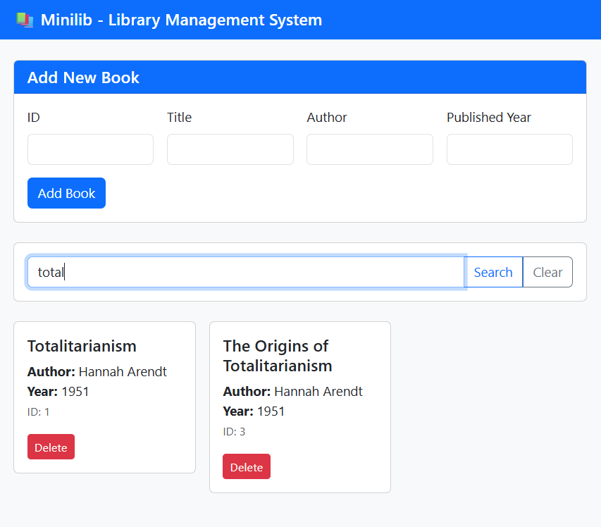
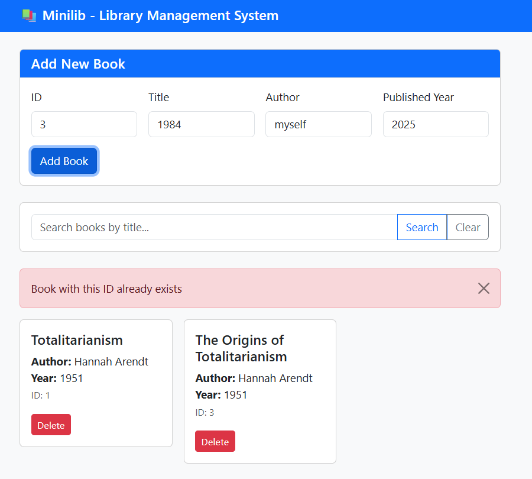

# Minilib

This is a small library to manage our books. It has the three APIs requested in the project + the "DELETE /books" API.

Team: Alvand
Members: Atefeh Mirzakhani & Sanan Naghshbandi

## Installation guide

Clone the repo and:

0. Install npm

bash
sudo apt install npm

1. Init and Install express

bash
npm init -y
npm install express

2. Create books.json

```json
[]
```

3. Start the server

```bash
node server.js
```

4. Open `ui/index.html` with your browser.

    4.1. Or, if you just want to checkout the backend APIs, Access them at http://localhost:3000/{API Endpoint(e.g. `books` or `books/search`)} 

## Files and Branches
- `server.js` handles the web socket and serves the clients by calling the API they call.
- `book.json` acts like a database. Reading and writing happens in it by `server.js`
- `ui/index.html` is the frontend view of Minilib, which works with Bootstrap and requires no dependendies to be installed.

## UI Documentation
We used bootstrap for the styles and called the server's APIs in the `<script>` block.

### Screenshots
- Search books (partially)


- Add books, maintaining unique names and IDs
